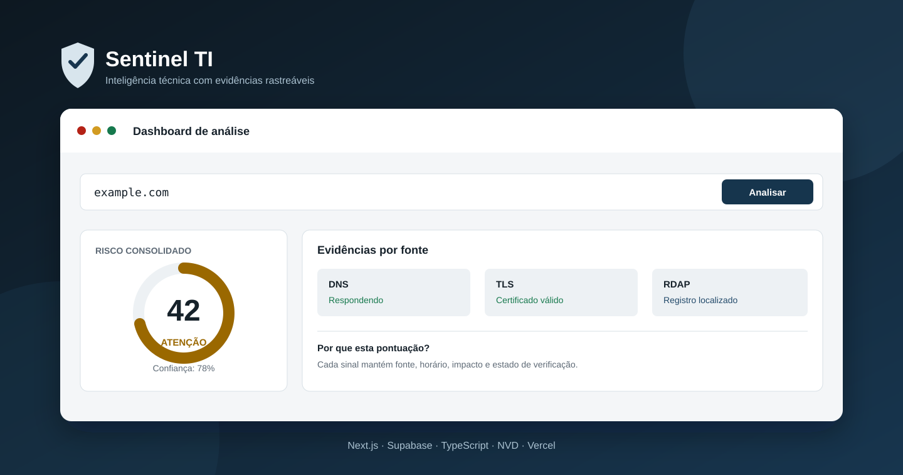
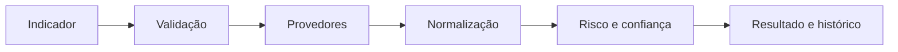

# Sentinel TI



[](https://sentinel-ti-jackson.vercel.app)
[](https://github.com/JacksonJeanPS/sentinel-ti/actions)
[](LICENSE)

Plataforma full stack de inteligência e diagnóstico que consolida evidências sobre IPs, domínios, URLs, hashes, certificados TLS e vulnerabilidades CVE. Projeto de portfólio desenvolvido por **Jackson Jean**, Analista de Suporte de TI Sênior com atuação em infraestrutura e operações críticas.

**[Acessar demonstração](https://sentinel-ti-jackson.vercel.app)** · **[Arquitetura](docs/ARCHITECTURE.md)** · **[Segurança](docs/SECURITY.md)** · **[Motor de risco](docs/SCORING.md)**

## Visão geral

O Sentinel TI reúne respostas de diferentes fontes, normaliza os dados e calcula risco e confiança de forma separada. A interface distingue evidência retornada, conclusão do sistema, ausência de resultado e indisponibilidade do provedor.

### Funcionalidades

- análise de IPv4, IPv6, domínio, URL, hash, TLS e CVE;
- consultas reais de DNS over HTTPS, RDAP, TLS e NVD;
- integrações opcionais com AbuseIPDB e VirusTotal;
- pontuação determinística, explicável e versionada;
- cadastro, confirmação de e-mail, login e recuperação de senha;
- dashboard protegido, histórico, filtros, favoritos e impressão em PDF;
- isolamento dos dados por usuário com PostgreSQL Row Level Security;
- proteção contra SSRF, timeout de provedores e falha parcial;
- tema claro/escuro e interface responsiva;
- testes unitários, testes end-to-end e integração contínua.

## Fluxo da análise



## Tecnologias

| Camada | Tecnologias |
| --- | --- |
| Interface | Next.js 16, React 19, TypeScript e Tailwind CSS 4 |
| Autenticação e dados | Supabase Auth, PostgreSQL e RLS |
| Validação e análise | Zod e motor determinístico próprio |
| Qualidade | ESLint, Vitest, Playwright e GitHub Actions |
| Publicação | Vercel |

## Executar localmente

Requisitos: Node.js 20 ou superior e um projeto Supabase.

```bash
git clone https://github.com/JacksonJeanPS/sentinel-ti.git
cd sentinel-ti
npm ci
cp .env.example .env.local
npm run dev
```

Preencha em `.env.local` a URL e a chave publicável do Supabase. Depois, execute a migration disponível em `supabase/migrations`. Chaves de provedores são opcionais e nunca devem ser enviadas ao Git.

### Verificações

```bash
npm run lint
npm run typecheck
npm test
npm run build
```

## Segurança e uso responsável

O servidor bloqueia destinos privados, loopback, link-local e endpoints de metadados de nuvem. Segredos ficam no servidor e as políticas RLS restringem cada registro ao respectivo proprietário. O Sentinel TI apoia triagem defensiva: ausência de evidência não comprova segurança e a classificação não substitui investigação humana.

Consulte [SECURITY.md](docs/SECURITY.md), [DATABASE.md](docs/DATABASE.md), [ARCHITECTURE.md](docs/ARCHITECTURE.md) e [SCORING.md](docs/SCORING.md).

## Próxima evolução: Sentinel Agent Windows

O roadmap inclui um agente defensivo para inventariar builds do Windows, atualizações KB, softwares, serviços e configurações de segurança; correlacionar versões com CVEs; e apresentar correções e mitigações. A proposta é transformar o painel atual em uma solução de gestão de vulnerabilidades focada em Windows, mantendo toda remediação sob aprovação humana.

Detalhes em [WINDOWS-AGENT-ROADMAP.md](docs/WINDOWS-AGENT-ROADMAP.md).

## Limitações atuais

- o resultado depende da cobertura, disponibilidade e cota de cada fonte;
- AbuseIPDB e VirusTotal exigem credenciais próprias;
- o agente Windows e a remediação assistida ainda fazem parte do roadmap;
- nenhuma análise executa arquivos, explora vulnerabilidades ou substitui uma auditoria especializada.

## Autor

**Jackson Jean Pereira de Sousa**  
Analista de Suporte de TI Sênior · Infraestrutura · Segurança defensiva

[LinkedIn](https://www.linkedin.com/in/jacksonjeanps) · [GitHub](https://github.com/JacksonJeanPS) · [Demonstração](https://sentinel-ti-jackson.vercel.app)

## Licença

Distribuído sob a licença [MIT](LICENSE). © 2026 Jackson Jean.
