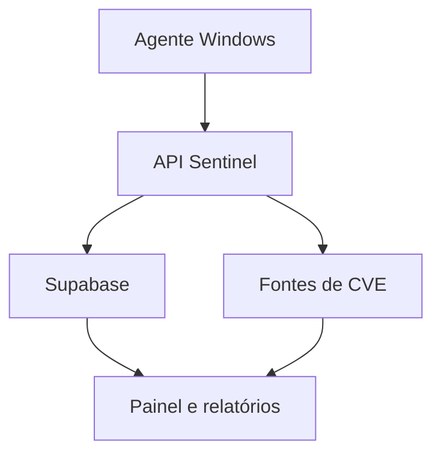

# Sentinel Agent Windows - roadmap

## Objetivo

Evoluir o Sentinel TI para uma plataforma defensiva de gestão de vulnerabilidades focada em endpoints Windows. O painel web continuará responsável por identidade, inventário, priorização, histórico e relatórios; um agente local fará somente a coleta autorizada de evidências.

## Escopo planejado

### Fase 1 - coletor local

- versão, edição, build e arquitetura do Windows;
- atualizações KB instaladas e pendentes;
- softwares instalados, versão e fabricante;
- estado do Microsoft Defender, Firewall, BitLocker e Secure Boot;
- serviços e portas locais em escuta;
- configurações de risco conhecidas, como SMBv1 e RDP exposto;
- exportação local em JSON, sem executar remediações.

### Fase 2 - correlação de vulnerabilidades

- normalização de produtos e versões;
- correlação com fontes oficiais de CVE e advisories de fabricantes;
- classificação por CVSS, exposição e evidência local;
- recomendação de KB, atualização, mitigação ou mudança de configuração;
- controle de falsos positivos e registro da origem de cada conclusão.

### Fase 3 - agente gerenciado

- serviço Windows assinado e atualizável;
- comunicação autenticada e criptografada com a API;
- inventário de múltiplos endpoints e histórico de alterações;
- políticas de coleta e intervalos configuráveis;
- integração futura com KACE, SCCM/Intune e Active Directory.

### Fase 4 - remediação assistida

- geração de scripts revisáveis;
- criação de plano de mudança e ponto de restauração quando aplicável;
- execução somente mediante aprovação explícita;
- trilha de auditoria, resultado, rollback documentado e segregação de privilégios.

## Princípios de segurança

- coleta mínima e autorizada;
- nenhuma exploração automática;
- nenhuma execução silenciosa de correções;
- evidência técnica separada da recomendação;
- privilégios mínimos e segredos fora do cliente;
- assinatura de artefatos e verificação de integridade;
- retenção limitada e isolamento por organização.

## Arquitetura proposta

## Critério para o primeiro MVP

O primeiro MVP será considerado funcional quando detectar corretamente o sistema, os programas, as KBs e um conjunto controlado de configurações inseguras em uma máquina de laboratório, produzindo evidências reproduzíveis e recomendações sem alterar o endpoint.
